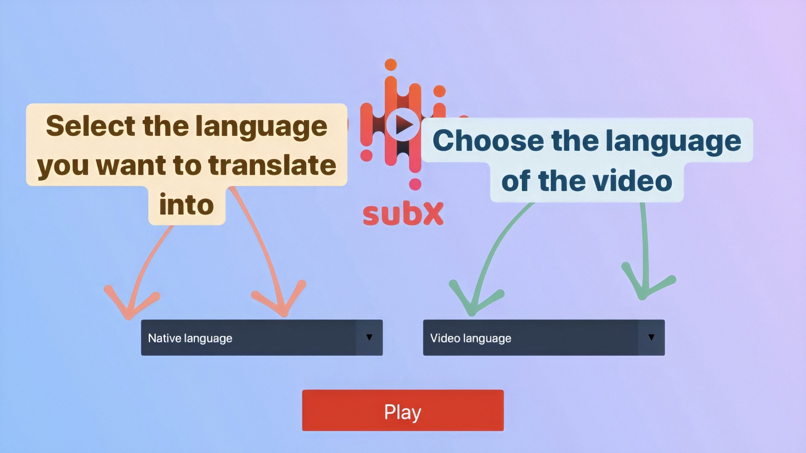

# SUB-X
A language learning tool for those who love watching YouTube videos
## Description
A web tool which allows users to watch YouTube videos along with subtitles and their translation to a chosen language. A user can click on an unknow word and get a translation of the word and sees the translation in the sentence context which is shown in the next line(translated subtitles)
The project uses a free Dictionary API

The project was written in a contribution with @danitze and was an extention of a Google-Code In task
#### Technology used:
HTML/CSS/JavaScript, Node.js, Python

## Team work
<table>
  <tr>
    <td><h4>@navimakarov</h4></td>
    <td><h4>@danitze</h4></td>
  </tr>
  <tr>
    <td>Project logic(backend)</td>
    <td>Web page design, style</td>
  </tr>
  <tr>
    <td>Fetching subtitles, calling API for translating them</td>
    <td>Correct video display on different screen sizes</td>
  </tr>
  <tr>
    <tdInterface for double subtitles</td>
    <td>Integration of YouTube video frame into the website</td>
  </tr>
  <tr>
    <td>Set of languages supported</td>
    <td>Properties window UI/UX</td>
  </tr>
  <tr>
    <td>Project Marketing</td>
    <td>Project Marketing</td>
  </tr>
 </table>
 
 ## Product Preview

